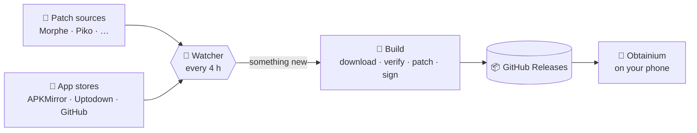

<div align="center">

 

# RVB · ReVanced & Morphe Builder

**Patched Android apps, built automatically and delivered to your phone through Obtainium.**
New patches or a new app version land → a fresh, signed APK appears in Releases. Nothing to build, nothing to remember.

[](OBTAINIUM.md)
[](https://github.com/softpyscho/rvb/releases)
[](https://github.com/softpyscho/rvb/releases)

[](https://github.com/softpyscho/rvb/actions/workflows/ci.yml)
[](https://github.com/softpyscho/rvb/stargazers)
[](LICENSE)


[**Get started**](#-get-started) · [**Apps**](#-supported-applications) · [**How it works**](#-how-it-works) · [**Releases**](https://github.com/softpyscho/rvb/releases) · [**Run your own**](#-run-your-own) · [**Docs**](#-documentation)

</div>

<br>

<table>
<tr>
<td width="33%" valign="top">

### ⚡ Always current
A watcher checks every patch source and app store every 4 hours and builds only what moved.

</td>
<td width="33%" valign="top">

### 🔔 Obtainium‑ready
Every app has a one‑tap link with its own APK filter. Updates install through Obtainium like any other app.

</td>
<td width="33%" valign="top">

### 🛡️ Verified, not trusted
Each download is checked for package id, signature and CPU architecture before anything is published.

</td>
</tr>
<tr>
<td valign="top">

### 🧩 Patched
Morphe‑family patches from several maintainers, applied to the stock APK and signed.

</td>
<td valign="top">

### 📦 Mirrored
Apps that publish no GitHub release are re‑hosted **unmodified**, so Obtainium can follow them too.

</td>
<td valign="top">

### 🧪 Two channels
Stable builds and a pre‑release channel for apps that follow their patch author's beta line.

</td>
</tr>
</table>

---

## 🚀 Get started

> [!TIP]
> Open this page **on your phone**: the **Add to Obtainium** badges below hand the app straight to Obtainium.

1. **Install [Obtainium](https://github.com/ImranR98/Obtainium/releases/latest).**
2. **Tap the *Add to Obtainium* badge** next to an app in the table below, then **Add**.
3. **Install it.** Obtainium follows this repository from now on and offers each new build.

Prefer everything at once? Obtainium → *Import/Export* → *Import from file* → [`obtainium-apps.json`](obtainium-apps.json).
Prefer a plain download? Grab the APK from the [latest release](https://github.com/softpyscho/rvb/releases/latest) — each release page lists exactly what that build contains.

> [!NOTE]
> Patched Google apps need [MicroG‑RE](https://github.com/MorpheApp/MicroG-RE/releases/latest) to sign in. Install it once.

---

## 📦 Supported Applications

Grouped by patch source, with the patches applied to each app. Versions and patch lists come from the latest
published build; the table is refreshed by CI after every build from the app config (see
[docs/fork-setup.md](docs/fork-setup.md) to change it).

<!-- APPS_START -->

> **Version** shows the version the patches *recommend* above the version that was *built* (they differ when a source no longer offers the recommended one). **APK Source** is where the stock APK of that build came from. ⚠️ in **Patches** means a patch the build meant to apply was skipped or failed - open the row to see which and why.

### 

> **Source:** [`MorpheApp/morphe-patches`](https://github.com/MorpheApp/morphe-patches)

<div align="center">

| App | Version | APK Source | Patches | Obtainium |
|:---|:-------:|:----------:|:--------|:---------:|
| [](https://play.google.com/store/apps/details?id=com.reddit.frontpage) | <br> | [APKMirror](https://www.apkmirror.com/apk/redditinc/reddit) | <details><summary><b>19 patches</b></summary><br>`App icon`<br>`Custom branding name for Reddit`<br>`Custom font`<br>`Disable modern home`<br>`Disable screenshot popup`<br>`Force system font`<br>`Hide ads`<br>`Hide Ask button`<br>`Hide communities shelf`<br>`Hide navigation buttons`<br>`Hide sidebar components`<br>`Hide Trending shelves`<br>`Open links directly`<br>`Open links externally`<br>`Remove subreddit dialog`<br>`Sanitize sharing links`<br>`Show view count`<br>`Spoof signature`<br>`Start as guest`<br>⚙️ appName=Reddit</details> | [](https://apps.obtainium.imranr.dev/redirect?r=obtainium%3A%2F%2Fapp%2F%7B%22id%22%3A%22com.reddit.frontpage%22%2C%22url%22%3A%22https%3A%2F%2Fgithub.com%2Fsoftpyscho%2Frvb%22%2C%22author%22%3A%22softpyscho%22%2C%22name%22%3A%22Reddit%22%2C%22installedVersion%22%3A%22%22%2C%22latestVersion%22%3A%22%22%2C%22apkUrls%22%3A%22%5B%5D%22%2C%22otherAssetUrls%22%3A%22%5B%5D%22%2C%22preferredApkIndex%22%3A0%2C%22additionalSettings%22%3A%22%7B%5C%22includePrereleases%5C%22%3Afalse%2C%5C%22fallbackToOlderReleases%5C%22%3Atrue%2C%5C%22filterReleaseTitlesByRegEx%5C%22%3A%5C%22%5C%22%2C%5C%22filterReleaseNotesByRegEx%5C%22%3A%5C%22%5C%22%2C%5C%22verifyLatestTag%5C%22%3Afalse%2C%5C%22dontSortReleasesList%5C%22%3Afalse%2C%5C%22useLatestAssetDateAsReleaseDate%5C%22%3Afalse%2C%5C%22trackOnly%5C%22%3Afalse%2C%5C%22versionExtractionRegEx%5C%22%3A%5C%22%5C%22%2C%5C%22matchGroupToUse%5C%22%3A%5C%22%5C%22%2C%5C%22versionDetection%5C%22%3Afalse%2C%5C%22useVersionCodeAsOSVersion%5C%22%3Afalse%2C%5C%22apkFilterRegEx%5C%22%3A%5C%22%5Ereddit-morphe-v.%2B-arm64-v8a%5C%5C%5C%5C.apk%24%5C%22%2C%5C%22invertAPKFilter%5C%22%3Afalse%2C%5C%22autoApkFilterByArch%5C%22%3Afalse%2C%5C%22appName%5C%22%3A%5C%22%5C%22%2C%5C%22appAuthor%5C%22%3A%5C%22%5C%22%2C%5C%22shizukuPretendToBeGooglePlay%5C%22%3Afalse%2C%5C%22allowInsecure%5C%22%3Afalse%2C%5C%22exemptFromBackgroundUpdates%5C%22%3Afalse%2C%5C%22skipUpdateNotifications%5C%22%3Afalse%2C%5C%22about%5C%22%3A%5C%22%5C%22%2C%5C%22refreshBeforeDownload%5C%22%3Afalse%7D%22%2C%22lastUpdateCheck%22%3Anull%2C%22pinned%22%3Afalse%2C%22categories%22%3A%5B%5D%2C%22releaseDate%22%3Anull%2C%22changeLog%22%3Anull%2C%22overrideSource%22%3Anull%2C%22allowIdChange%22%3Afalse%2C%22pendingRepoRenameUrl%22%3Anull%7D) |

</div>

---

### 

> **Source:** [`arandomhooman/hoomans-morphe-patches`](https://github.com/arandomhooman/hoomans-morphe-patches)

<div align="center">

| App | Version | APK Source | Patches | Obtainium |
|:---|:-------:|:----------:|:--------|:---------:|
| [](https://play.google.com/store/apps/details?id=com.paget96.batteryguru) | <br> | [APKMirror](https://www.apkmirror.com/apk/paget96/battery-guru-health-saver) | <details><summary><b>1 patch</b></summary><br>`Unlock PRO`</details> | [](https://apps.obtainium.imranr.dev/redirect?r=obtainium%3A%2F%2Fapp%2F%7B%22id%22%3A%22com.paget96.batteryguru%22%2C%22url%22%3A%22https%3A%2F%2Fgithub.com%2Fsoftpyscho%2Frvb%22%2C%22author%22%3A%22softpyscho%22%2C%22name%22%3A%22Battery%20Guru%22%2C%22installedVersion%22%3A%22%22%2C%22latestVersion%22%3A%22%22%2C%22apkUrls%22%3A%22%5B%5D%22%2C%22otherAssetUrls%22%3A%22%5B%5D%22%2C%22preferredApkIndex%22%3A0%2C%22additionalSettings%22%3A%22%7B%5C%22includePrereleases%5C%22%3Afalse%2C%5C%22fallbackToOlderReleases%5C%22%3Atrue%2C%5C%22filterReleaseTitlesByRegEx%5C%22%3A%5C%22%5C%22%2C%5C%22filterReleaseNotesByRegEx%5C%22%3A%5C%22%5C%22%2C%5C%22verifyLatestTag%5C%22%3Afalse%2C%5C%22dontSortReleasesList%5C%22%3Afalse%2C%5C%22useLatestAssetDateAsReleaseDate%5C%22%3Afalse%2C%5C%22trackOnly%5C%22%3Afalse%2C%5C%22versionExtractionRegEx%5C%22%3A%5C%22%5C%22%2C%5C%22matchGroupToUse%5C%22%3A%5C%22%5C%22%2C%5C%22versionDetection%5C%22%3Afalse%2C%5C%22useVersionCodeAsOSVersion%5C%22%3Afalse%2C%5C%22apkFilterRegEx%5C%22%3A%5C%22%5Ebattery-guru-morphe-v.%2B-arm64-v8a%5C%5C%5C%5C.apk%24%5C%22%2C%5C%22invertAPKFilter%5C%22%3Afalse%2C%5C%22autoApkFilterByArch%5C%22%3Afalse%2C%5C%22appName%5C%22%3A%5C%22%5C%22%2C%5C%22appAuthor%5C%22%3A%5C%22%5C%22%2C%5C%22shizukuPretendToBeGooglePlay%5C%22%3Afalse%2C%5C%22allowInsecure%5C%22%3Afalse%2C%5C%22exemptFromBackgroundUpdates%5C%22%3Afalse%2C%5C%22skipUpdateNotifications%5C%22%3Afalse%2C%5C%22about%5C%22%3A%5C%22%5C%22%2C%5C%22refreshBeforeDownload%5C%22%3Afalse%7D%22%2C%22lastUpdateCheck%22%3Anull%2C%22pinned%22%3Afalse%2C%22categories%22%3A%5B%5D%2C%22releaseDate%22%3Anull%2C%22changeLog%22%3Anull%2C%22overrideSource%22%3Anull%2C%22allowIdChange%22%3Afalse%2C%22pendingRepoRenameUrl%22%3Anull%7D) |

</div>

---

### 

> **Source:** [`crimera/piko`](https://github.com/crimera/piko)

<div align="center">

| App | Version | APK Source | Patches | Obtainium |
|:---|:-------:|:----------:|:--------|:---------:|
| [](https://play.google.com/store/apps/details?id=com.twitter.android) | <br> | [APKMirror](https://www.apkmirror.com/apk/x-corp/twitter) | <details><summary><b>71 patches</b></summary><br>`Add ability to copy media link`<br>`Block redirecting to X Lite`<br>`Block update screen`<br>`Change app icon`<br>`Change version code`<br>`Clear tracking params`<br>`Control video auto scroll`<br>`Custom download folder`<br>`Custom emoji font`<br>`Custom font`<br>`Custom share menu`<br>`Custom sharing domain`<br>`Customise post font size`<br>`Customize default reply sorting`<br>`Customize explore tabs`<br>`Customize Inline action Bar items`<br>`Customize Navigation Bar items`<br>`Customize notification tabs`<br>`Customize profile tabs`<br>`Customize search suggestions`<br>`Customize search tab items`<br>`Customize side bar items`<br>`Customize timeline top bar`<br>`Delete from database`<br>`Disable auto timeline scroll on launch`<br>`Disable chirp font`<br>`Download patch`<br>`Enable debug menu for posts`<br>`Enable force HD videos`<br>`Enable PiP mode automatically`<br>`Enable Undo Posts`<br>`Force enable translate`<br>`Handle custom twitter links`<br>`Hide badges from navigation bar icons`<br>`Hide Banner`<br>`Hide bookmark icon in timeline`<br>`Hide community badges`<br>`Hide Community Notes`<br>`Hide FAB`<br>`Hide FAB Menu Buttons`<br>`Hide followed by context`<br>`Hide hidden replies`<br>`Hide immersive player`<br>`Hide Live Threads`<br>`Hide nudge button`<br>`Hide post metrics`<br>`Hide promote button`<br>`Hide recommendation items`<br>`Hide Recommended Users`<br>`Hook feature flag`<br>`Import/Export login token`<br>`Legacy share links`<br>`Log server response`<br>`More information on profile`<br>`Native downloader`<br>`Native reader mode`<br>`Native translator`<br>`No shortened URL`<br>`Pause search suggestions`<br>`Remove Ads`<br>`Remove premium upsell`<br>`Remove search suggestions`<br>`Remove view count`<br>`Round off numbers`<br>`Selectable Text`<br>`Share Tweet as Image`<br>`Show changelogs`<br>`Show poll results`<br>`Show post source label`<br>`Show sensitive media`<br>`Support external downloader`</details> | [](https://apps.obtainium.imranr.dev/redirect?r=obtainium%3A%2F%2Fapp%2F%7B%22id%22%3A%22com.twitter.android%22%2C%22url%22%3A%22https%3A%2F%2Fgithub.com%2Fsoftpyscho%2Frvb%22%2C%22author%22%3A%22softpyscho%22%2C%22name%22%3A%22Twitter%22%2C%22installedVersion%22%3A%22%22%2C%22latestVersion%22%3A%22%22%2C%22apkUrls%22%3A%22%5B%5D%22%2C%22otherAssetUrls%22%3A%22%5B%5D%22%2C%22preferredApkIndex%22%3A0%2C%22additionalSettings%22%3A%22%7B%5C%22includePrereleases%5C%22%3Afalse%2C%5C%22fallbackToOlderReleases%5C%22%3Atrue%2C%5C%22filterReleaseTitlesByRegEx%5C%22%3A%5C%22%5C%22%2C%5C%22filterReleaseNotesByRegEx%5C%22%3A%5C%22%5C%22%2C%5C%22verifyLatestTag%5C%22%3Afalse%2C%5C%22dontSortReleasesList%5C%22%3Afalse%2C%5C%22useLatestAssetDateAsReleaseDate%5C%22%3Afalse%2C%5C%22trackOnly%5C%22%3Afalse%2C%5C%22versionExtractionRegEx%5C%22%3A%5C%22%5C%22%2C%5C%22matchGroupToUse%5C%22%3A%5C%22%5C%22%2C%5C%22versionDetection%5C%22%3Afalse%2C%5C%22useVersionCodeAsOSVersion%5C%22%3Afalse%2C%5C%22apkFilterRegEx%5C%22%3A%5C%22%5Etwitter-morphe-v.%2B-arm64-v8a%5C%5C%5C%5C.apk%24%5C%22%2C%5C%22invertAPKFilter%5C%22%3Afalse%2C%5C%22autoApkFilterByArch%5C%22%3Afalse%2C%5C%22appName%5C%22%3A%5C%22%5C%22%2C%5C%22appAuthor%5C%22%3A%5C%22%5C%22%2C%5C%22shizukuPretendToBeGooglePlay%5C%22%3Afalse%2C%5C%22allowInsecure%5C%22%3Afalse%2C%5C%22exemptFromBackgroundUpdates%5C%22%3Afalse%2C%5C%22skipUpdateNotifications%5C%22%3Afalse%2C%5C%22about%5C%22%3A%5C%22%5C%22%2C%5C%22refreshBeforeDownload%5C%22%3Afalse%7D%22%2C%22lastUpdateCheck%22%3Anull%2C%22pinned%22%3Afalse%2C%22categories%22%3A%5B%5D%2C%22releaseDate%22%3Anull%2C%22changeLog%22%3Anull%2C%22overrideSource%22%3Anull%2C%22allowIdChange%22%3Afalse%2C%22pendingRepoRenameUrl%22%3Anull%7D) |
| [](https://play.google.com/store/apps/details?id=com.instagram.android) | <br> | Cache | <details><summary><b>63 patches</b></summary><br>`Add settings`<br>`Allow user network certificate`<br>`Change like animation`<br>`Change version code`<br>`Copy comment`<br>`Custom font`<br>`Custom sharing domain`<br>`Customise story ring size`<br>`Customise story timestamp`<br>`Customize navigation bar`<br>`Disable ads`<br>`Disable analytics`<br>`Disable comments`<br>`Disable discover people`<br>`Disable double tap like`<br>`Disable explore`<br>`Disable highlights`<br>`Disable Reels scrolling`<br>`Disable screenshot detection`<br>`Disable stories`<br>`Disable story flipping`<br>`Disable swipe to create`<br>`Disable typing status`<br>`Disable video autoplay`<br>`Download media`<br>`Download voice message`<br>`External downloader`<br>`Filter stories`<br>`Focus Lock`<br>`Friendship status indicator`<br>`Hide group creation button on sharesheet`<br>`Hide notes tray`<br>`Hide Reels follow button`<br>`Hide reshare button`<br>`Hide save buttons`<br>`Hide share button`<br>`Hide stories tray`<br>`Hide suggested content`<br>`Improve image viewing`<br>`Inbox lock`<br>`Limit feed to following profiles`<br>`Loop story`<br>`Make ephemeral media permanent`<br>`Mark chat as read manually`<br>`More options on post`<br>`More options on profile`<br>`Open links externally`<br>`Recommended flags`<br>`Remove build expired popup`<br>`Remove empty bottom space`<br>`Sanitize share links`<br>`Save deleted messages`<br>`Save Instants`<br>`Save media comment`<br>`Theme`<br>`Unlock developer options`<br>`Unlock employee options`<br>`Unlock Plus benefits`<br>`Validate links`<br>`View DMs anonymously`<br>`View live anonymously`<br>`View stories anonymously`<br>`View story mentions`</details> | [](https://apps.obtainium.imranr.dev/redirect?r=obtainium%3A%2F%2Fapp%2F%7B%22id%22%3A%22com.instagram.android%22%2C%22url%22%3A%22https%3A%2F%2Fgithub.com%2Fsoftpyscho%2Frvb%22%2C%22author%22%3A%22softpyscho%22%2C%22name%22%3A%22Instagram%22%2C%22installedVersion%22%3A%22%22%2C%22latestVersion%22%3A%22%22%2C%22apkUrls%22%3A%22%5B%5D%22%2C%22otherAssetUrls%22%3A%22%5B%5D%22%2C%22preferredApkIndex%22%3A0%2C%22additionalSettings%22%3A%22%7B%5C%22includePrereleases%5C%22%3Atrue%2C%5C%22fallbackToOlderReleases%5C%22%3Atrue%2C%5C%22filterReleaseTitlesByRegEx%5C%22%3A%5C%22%5C%22%2C%5C%22filterReleaseNotesByRegEx%5C%22%3A%5C%22%5C%22%2C%5C%22verifyLatestTag%5C%22%3Afalse%2C%5C%22dontSortReleasesList%5C%22%3Afalse%2C%5C%22useLatestAssetDateAsReleaseDate%5C%22%3Afalse%2C%5C%22trackOnly%5C%22%3Afalse%2C%5C%22versionExtractionRegEx%5C%22%3A%5C%22%5C%22%2C%5C%22matchGroupToUse%5C%22%3A%5C%22%5C%22%2C%5C%22versionDetection%5C%22%3Afalse%2C%5C%22useVersionCodeAsOSVersion%5C%22%3Afalse%2C%5C%22apkFilterRegEx%5C%22%3A%5C%22%5Einstagram-morphe-v.%2B-arm64-v8a%5C%5C%5C%5C.apk%24%5C%22%2C%5C%22invertAPKFilter%5C%22%3Afalse%2C%5C%22autoApkFilterByArch%5C%22%3Afalse%2C%5C%22appName%5C%22%3A%5C%22%5C%22%2C%5C%22appAuthor%5C%22%3A%5C%22%5C%22%2C%5C%22shizukuPretendToBeGooglePlay%5C%22%3Afalse%2C%5C%22allowInsecure%5C%22%3Afalse%2C%5C%22exemptFromBackgroundUpdates%5C%22%3Afalse%2C%5C%22skipUpdateNotifications%5C%22%3Afalse%2C%5C%22about%5C%22%3A%5C%22%5C%22%2C%5C%22refreshBeforeDownload%5C%22%3Afalse%7D%22%2C%22lastUpdateCheck%22%3Anull%2C%22pinned%22%3Afalse%2C%22categories%22%3A%5B%5D%2C%22releaseDate%22%3Anull%2C%22changeLog%22%3Anull%2C%22overrideSource%22%3Anull%2C%22allowIdChange%22%3Afalse%2C%22pendingRepoRenameUrl%22%3Anull%7D) |

</div>

---

### 

> **Source:** [`hoo-dles/morphe-patches`](https://github.com/hoo-dles/morphe-patches)

<div align="center">

| App | Version | APK Source | Patches | Obtainium |
|:---|:-------:|:----------:|:--------|:---------:|
| [](https://play.google.com/store/apps/details?id=com.xodo.pdf.reader) | <br> | [APKMirror](https://www.apkmirror.com/apk/apryse-software-inc/xodo-pdf-reader-editor) | <details><summary><b>1 patch</b></summary><br>`Enable Pro`</details> | [](https://apps.obtainium.imranr.dev/redirect?r=obtainium%3A%2F%2Fapp%2F%7B%22id%22%3A%22com.xodo.pdf.reader%22%2C%22url%22%3A%22https%3A%2F%2Fgithub.com%2Fsoftpyscho%2Frvb%22%2C%22author%22%3A%22softpyscho%22%2C%22name%22%3A%22Xodo%22%2C%22installedVersion%22%3A%22%22%2C%22latestVersion%22%3A%22%22%2C%22apkUrls%22%3A%22%5B%5D%22%2C%22otherAssetUrls%22%3A%22%5B%5D%22%2C%22preferredApkIndex%22%3A0%2C%22additionalSettings%22%3A%22%7B%5C%22includePrereleases%5C%22%3Afalse%2C%5C%22fallbackToOlderReleases%5C%22%3Atrue%2C%5C%22filterReleaseTitlesByRegEx%5C%22%3A%5C%22%5C%22%2C%5C%22filterReleaseNotesByRegEx%5C%22%3A%5C%22%5C%22%2C%5C%22verifyLatestTag%5C%22%3Afalse%2C%5C%22dontSortReleasesList%5C%22%3Afalse%2C%5C%22useLatestAssetDateAsReleaseDate%5C%22%3Afalse%2C%5C%22trackOnly%5C%22%3Afalse%2C%5C%22versionExtractionRegEx%5C%22%3A%5C%22%5C%22%2C%5C%22matchGroupToUse%5C%22%3A%5C%22%5C%22%2C%5C%22versionDetection%5C%22%3Afalse%2C%5C%22useVersionCodeAsOSVersion%5C%22%3Afalse%2C%5C%22apkFilterRegEx%5C%22%3A%5C%22%5Exodo-morphe-v.%2B-arm64-v8a%5C%5C%5C%5C.apk%24%5C%22%2C%5C%22invertAPKFilter%5C%22%3Afalse%2C%5C%22autoApkFilterByArch%5C%22%3Afalse%2C%5C%22appName%5C%22%3A%5C%22%5C%22%2C%5C%22appAuthor%5C%22%3A%5C%22%5C%22%2C%5C%22shizukuPretendToBeGooglePlay%5C%22%3Afalse%2C%5C%22allowInsecure%5C%22%3Afalse%2C%5C%22exemptFromBackgroundUpdates%5C%22%3Afalse%2C%5C%22skipUpdateNotifications%5C%22%3Afalse%2C%5C%22about%5C%22%3A%5C%22%5C%22%2C%5C%22refreshBeforeDownload%5C%22%3Afalse%7D%22%2C%22lastUpdateCheck%22%3Anull%2C%22pinned%22%3Afalse%2C%22categories%22%3A%5B%5D%2C%22releaseDate%22%3Anull%2C%22changeLog%22%3Anull%2C%22overrideSource%22%3Anull%2C%22allowIdChange%22%3Afalse%2C%22pendingRepoRenameUrl%22%3Anull%7D) |
| [](https://play.google.com/store/apps/details?id=com.amazon.avod.thirdpartyclient) | <br> | [APKMirror](https://www.apkmirror.com/apk/amazon-mobile-llc/amazon-prime-video) | <details><summary><b>3 patches</b></summary><br>`Enable speed control`<br>`Rename shared permissions`<br>`Skip ads`</details> | [](https://apps.obtainium.imranr.dev/redirect?r=obtainium%3A%2F%2Fapp%2F%7B%22id%22%3A%22com.amazon.avod.thirdpartyclient%22%2C%22url%22%3A%22https%3A%2F%2Fgithub.com%2Fsoftpyscho%2Frvb%22%2C%22author%22%3A%22softpyscho%22%2C%22name%22%3A%22Amazon%20Prime%20Video%22%2C%22installedVersion%22%3A%22%22%2C%22latestVersion%22%3A%22%22%2C%22apkUrls%22%3A%22%5B%5D%22%2C%22otherAssetUrls%22%3A%22%5B%5D%22%2C%22preferredApkIndex%22%3A0%2C%22additionalSettings%22%3A%22%7B%5C%22includePrereleases%5C%22%3Afalse%2C%5C%22fallbackToOlderReleases%5C%22%3Atrue%2C%5C%22filterReleaseTitlesByRegEx%5C%22%3A%5C%22%5C%22%2C%5C%22filterReleaseNotesByRegEx%5C%22%3A%5C%22%5C%22%2C%5C%22verifyLatestTag%5C%22%3Afalse%2C%5C%22dontSortReleasesList%5C%22%3Afalse%2C%5C%22useLatestAssetDateAsReleaseDate%5C%22%3Afalse%2C%5C%22trackOnly%5C%22%3Afalse%2C%5C%22versionExtractionRegEx%5C%22%3A%5C%22%5C%22%2C%5C%22matchGroupToUse%5C%22%3A%5C%22%5C%22%2C%5C%22versionDetection%5C%22%3Afalse%2C%5C%22useVersionCodeAsOSVersion%5C%22%3Afalse%2C%5C%22apkFilterRegEx%5C%22%3A%5C%22%5Eamazon-prime-video-morphe-v.%2B-arm64-v8a%5C%5C%5C%5C.apk%24%5C%22%2C%5C%22invertAPKFilter%5C%22%3Afalse%2C%5C%22autoApkFilterByArch%5C%22%3Afalse%2C%5C%22appName%5C%22%3A%5C%22%5C%22%2C%5C%22appAuthor%5C%22%3A%5C%22%5C%22%2C%5C%22shizukuPretendToBeGooglePlay%5C%22%3Afalse%2C%5C%22allowInsecure%5C%22%3Afalse%2C%5C%22exemptFromBackgroundUpdates%5C%22%3Afalse%2C%5C%22skipUpdateNotifications%5C%22%3Afalse%2C%5C%22about%5C%22%3A%5C%22%5C%22%2C%5C%22refreshBeforeDownload%5C%22%3Afalse%7D%22%2C%22lastUpdateCheck%22%3Anull%2C%22pinned%22%3Afalse%2C%22categories%22%3A%5B%5D%2C%22releaseDate%22%3Anull%2C%22changeLog%22%3Anull%2C%22overrideSource%22%3Anull%2C%22allowIdChange%22%3Afalse%2C%22pendingRepoRenameUrl%22%3Anull%7D) |

</div>

---

### 

> **Source:** [`Paresh-Maheshwari/paresh-patches`](https://gitlab.com/Paresh-Maheshwari/paresh-patches) (GitLab)

<div align="center">

| App | Version | APK Source | Patches | Obtainium |
|:---|:-------:|:----------:|:--------|:---------:|
| [](https://play.google.com/store/apps/details?id=com.truecaller) | <br> | [Archive](https://archive.org/download/geologically/apks/com.truecaller) | <details><summary><b>10 patches</b></summary><br>`Disable telemetry`<br>`Disable update check`<br>`GMS sign-in bypass`<br>`Hide Assistant tab`<br>`Hide Family Protection button`<br>`Hide Premium from settings`<br>`Hide Premium tab`<br>`Hide Scams tab`<br>`Neutralize third-party SDKs`<br>`Truecaller Premium`</details> | [](https://apps.obtainium.imranr.dev/redirect?r=obtainium%3A%2F%2Fapp%2F%7B%22id%22%3A%22com.truecaller%22%2C%22url%22%3A%22https%3A%2F%2Fgithub.com%2Fsoftpyscho%2Frvb%22%2C%22author%22%3A%22softpyscho%22%2C%22name%22%3A%22Truecaller%22%2C%22installedVersion%22%3A%22%22%2C%22latestVersion%22%3A%22%22%2C%22apkUrls%22%3A%22%5B%5D%22%2C%22otherAssetUrls%22%3A%22%5B%5D%22%2C%22preferredApkIndex%22%3A0%2C%22additionalSettings%22%3A%22%7B%5C%22includePrereleases%5C%22%3Afalse%2C%5C%22fallbackToOlderReleases%5C%22%3Atrue%2C%5C%22filterReleaseTitlesByRegEx%5C%22%3A%5C%22%5C%22%2C%5C%22filterReleaseNotesByRegEx%5C%22%3A%5C%22%5C%22%2C%5C%22verifyLatestTag%5C%22%3Afalse%2C%5C%22dontSortReleasesList%5C%22%3Afalse%2C%5C%22useLatestAssetDateAsReleaseDate%5C%22%3Afalse%2C%5C%22trackOnly%5C%22%3Afalse%2C%5C%22versionExtractionRegEx%5C%22%3A%5C%22%5C%22%2C%5C%22matchGroupToUse%5C%22%3A%5C%22%5C%22%2C%5C%22versionDetection%5C%22%3Afalse%2C%5C%22useVersionCodeAsOSVersion%5C%22%3Afalse%2C%5C%22apkFilterRegEx%5C%22%3A%5C%22%5Etruecaller-morphe-v.%2B-arm64-v8a%5C%5C%5C%5C.apk%24%5C%22%2C%5C%22invertAPKFilter%5C%22%3Afalse%2C%5C%22autoApkFilterByArch%5C%22%3Afalse%2C%5C%22appName%5C%22%3A%5C%22%5C%22%2C%5C%22appAuthor%5C%22%3A%5C%22%5C%22%2C%5C%22shizukuPretendToBeGooglePlay%5C%22%3Afalse%2C%5C%22allowInsecure%5C%22%3Afalse%2C%5C%22exemptFromBackgroundUpdates%5C%22%3Afalse%2C%5C%22skipUpdateNotifications%5C%22%3Afalse%2C%5C%22about%5C%22%3A%5C%22%5C%22%2C%5C%22refreshBeforeDownload%5C%22%3Afalse%7D%22%2C%22lastUpdateCheck%22%3Anull%2C%22pinned%22%3Afalse%2C%22categories%22%3A%5B%5D%2C%22releaseDate%22%3Anull%2C%22changeLog%22%3Anull%2C%22overrideSource%22%3Anull%2C%22allowIdChange%22%3Afalse%2C%22pendingRepoRenameUrl%22%3Anull%7D) |
| [](https://play.google.com/store/apps/details?id=com.ticktick.task) | <br> | [APKMirror](https://www.apkmirror.com/apk/ticktick-limited/ticktick-to-do-list-with-reminder-day-planner) | <details><summary><b>3 patches</b></summary><br>`Restore notifications`<br>`Restore reminder alarms`<br>`TickTick Premium`</details> | [](https://apps.obtainium.imranr.dev/redirect?r=obtainium%3A%2F%2Fapp%2F%7B%22id%22%3A%22com.ticktick.task%22%2C%22url%22%3A%22https%3A%2F%2Fgithub.com%2Fsoftpyscho%2Frvb%22%2C%22author%22%3A%22softpyscho%22%2C%22name%22%3A%22TickTick%22%2C%22installedVersion%22%3A%22%22%2C%22latestVersion%22%3A%22%22%2C%22apkUrls%22%3A%22%5B%5D%22%2C%22otherAssetUrls%22%3A%22%5B%5D%22%2C%22preferredApkIndex%22%3A0%2C%22additionalSettings%22%3A%22%7B%5C%22includePrereleases%5C%22%3Afalse%2C%5C%22fallbackToOlderReleases%5C%22%3Atrue%2C%5C%22filterReleaseTitlesByRegEx%5C%22%3A%5C%22%5C%22%2C%5C%22filterReleaseNotesByRegEx%5C%22%3A%5C%22%5C%22%2C%5C%22verifyLatestTag%5C%22%3Afalse%2C%5C%22dontSortReleasesList%5C%22%3Afalse%2C%5C%22useLatestAssetDateAsReleaseDate%5C%22%3Afalse%2C%5C%22trackOnly%5C%22%3Afalse%2C%5C%22versionExtractionRegEx%5C%22%3A%5C%22%5C%22%2C%5C%22matchGroupToUse%5C%22%3A%5C%22%5C%22%2C%5C%22versionDetection%5C%22%3Afalse%2C%5C%22useVersionCodeAsOSVersion%5C%22%3Afalse%2C%5C%22apkFilterRegEx%5C%22%3A%5C%22%5Eticktick-morphe-v.%2B-arm64-v8a%5C%5C%5C%5C.apk%24%5C%22%2C%5C%22invertAPKFilter%5C%22%3Afalse%2C%5C%22autoApkFilterByArch%5C%22%3Afalse%2C%5C%22appName%5C%22%3A%5C%22%5C%22%2C%5C%22appAuthor%5C%22%3A%5C%22%5C%22%2C%5C%22shizukuPretendToBeGooglePlay%5C%22%3Afalse%2C%5C%22allowInsecure%5C%22%3Afalse%2C%5C%22exemptFromBackgroundUpdates%5C%22%3Afalse%2C%5C%22skipUpdateNotifications%5C%22%3Afalse%2C%5C%22about%5C%22%3A%5C%22%5C%22%2C%5C%22refreshBeforeDownload%5C%22%3Afalse%7D%22%2C%22lastUpdateCheck%22%3Anull%2C%22pinned%22%3Afalse%2C%22categories%22%3A%5B%5D%2C%22releaseDate%22%3Anull%2C%22changeLog%22%3Anull%2C%22overrideSource%22%3Anull%2C%22allowIdChange%22%3Afalse%2C%22pendingRepoRenameUrl%22%3Anull%7D) |

</div>

---

### 

> **Source:** [`rabilrbl/fluffy-patches`](https://github.com/rabilrbl/fluffy-patches)

<div align="center">

| App | Version | APK Source | Patches | Obtainium |
|:---|:-------:|:----------:|:--------|:---------:|
| [](https://www.apkmirror.com/apk/sleep-tracker-alarm-clock-by-delightroom/alarmy-challenge-alarm-clock) | <br> | [Uptodown](https://alarmy.en.uptodown.com/android) | <details><summary><b>1 patch</b></summary><br>`Unlock Premium`</details> | [](https://apps.obtainium.imranr.dev/redirect?r=obtainium%3A%2F%2Fapp%2F%7B%22id%22%3A%22droom.sleepIfUCan%22%2C%22url%22%3A%22https%3A%2F%2Fgithub.com%2Fsoftpyscho%2Frvb%22%2C%22author%22%3A%22softpyscho%22%2C%22name%22%3A%22Alarmy%22%2C%22installedVersion%22%3A%22%22%2C%22latestVersion%22%3A%22%22%2C%22apkUrls%22%3A%22%5B%5D%22%2C%22otherAssetUrls%22%3A%22%5B%5D%22%2C%22preferredApkIndex%22%3A0%2C%22additionalSettings%22%3A%22%7B%5C%22includePrereleases%5C%22%3Afalse%2C%5C%22fallbackToOlderReleases%5C%22%3Atrue%2C%5C%22filterReleaseTitlesByRegEx%5C%22%3A%5C%22%5C%22%2C%5C%22filterReleaseNotesByRegEx%5C%22%3A%5C%22%5C%22%2C%5C%22verifyLatestTag%5C%22%3Afalse%2C%5C%22dontSortReleasesList%5C%22%3Afalse%2C%5C%22useLatestAssetDateAsReleaseDate%5C%22%3Afalse%2C%5C%22trackOnly%5C%22%3Afalse%2C%5C%22versionExtractionRegEx%5C%22%3A%5C%22%5C%22%2C%5C%22matchGroupToUse%5C%22%3A%5C%22%5C%22%2C%5C%22versionDetection%5C%22%3Afalse%2C%5C%22useVersionCodeAsOSVersion%5C%22%3Afalse%2C%5C%22apkFilterRegEx%5C%22%3A%5C%22%5Ealarmy-morphe-v.%2B-arm64-v8a%5C%5C%5C%5C.apk%24%5C%22%2C%5C%22invertAPKFilter%5C%22%3Afalse%2C%5C%22autoApkFilterByArch%5C%22%3Afalse%2C%5C%22appName%5C%22%3A%5C%22%5C%22%2C%5C%22appAuthor%5C%22%3A%5C%22%5C%22%2C%5C%22shizukuPretendToBeGooglePlay%5C%22%3Afalse%2C%5C%22allowInsecure%5C%22%3Afalse%2C%5C%22exemptFromBackgroundUpdates%5C%22%3Afalse%2C%5C%22skipUpdateNotifications%5C%22%3Afalse%2C%5C%22about%5C%22%3A%5C%22%5C%22%2C%5C%22refreshBeforeDownload%5C%22%3Afalse%7D%22%2C%22lastUpdateCheck%22%3Anull%2C%22pinned%22%3Afalse%2C%22categories%22%3A%5B%5D%2C%22releaseDate%22%3Anull%2C%22changeLog%22%3Anull%2C%22overrideSource%22%3Anull%2C%22allowIdChange%22%3Afalse%2C%22pendingRepoRenameUrl%22%3Anull%7D) |

</div>

---

### 

> **Source:** [`rushiranpise/morphe-patches`](https://github.com/rushiranpise/morphe-patches)

<div align="center">

| App | Version | APK Source | Patches | Obtainium |
|:---|:-------:|:----------:|:--------|:---------:|
| [](https://play.google.com/store/apps/details?id=com.cloudflare.onedotonedotonedotone) | <br> | [APKMirror](https://www.apkmirror.com/apk/cloudflare/1-1-1-1-faster-safer-internet) | <details><summary><b>2 patches</b></summary><br>`Disable Analytics / Telemetry`<br>`Spoof WARP+ Unlimited UI`</details> | [](https://apps.obtainium.imranr.dev/redirect?r=obtainium%3A%2F%2Fapp%2F%7B%22id%22%3A%22com.cloudflare.onedotonedotonedotone%22%2C%22url%22%3A%22https%3A%2F%2Fgithub.com%2Fsoftpyscho%2Frvb%22%2C%22author%22%3A%22softpyscho%22%2C%22name%22%3A%22WARP%22%2C%22installedVersion%22%3A%22%22%2C%22latestVersion%22%3A%22%22%2C%22apkUrls%22%3A%22%5B%5D%22%2C%22otherAssetUrls%22%3A%22%5B%5D%22%2C%22preferredApkIndex%22%3A0%2C%22additionalSettings%22%3A%22%7B%5C%22includePrereleases%5C%22%3Afalse%2C%5C%22fallbackToOlderReleases%5C%22%3Atrue%2C%5C%22filterReleaseTitlesByRegEx%5C%22%3A%5C%22%5C%22%2C%5C%22filterReleaseNotesByRegEx%5C%22%3A%5C%22%5C%22%2C%5C%22verifyLatestTag%5C%22%3Afalse%2C%5C%22dontSortReleasesList%5C%22%3Afalse%2C%5C%22useLatestAssetDateAsReleaseDate%5C%22%3Afalse%2C%5C%22trackOnly%5C%22%3Afalse%2C%5C%22versionExtractionRegEx%5C%22%3A%5C%22%5C%22%2C%5C%22matchGroupToUse%5C%22%3A%5C%22%5C%22%2C%5C%22versionDetection%5C%22%3Afalse%2C%5C%22useVersionCodeAsOSVersion%5C%22%3Afalse%2C%5C%22apkFilterRegEx%5C%22%3A%5C%22%5Ewarp-morphe-v.%2B-arm64-v8a%5C%5C%5C%5C.apk%24%5C%22%2C%5C%22invertAPKFilter%5C%22%3Afalse%2C%5C%22autoApkFilterByArch%5C%22%3Afalse%2C%5C%22appName%5C%22%3A%5C%22%5C%22%2C%5C%22appAuthor%5C%22%3A%5C%22%5C%22%2C%5C%22shizukuPretendToBeGooglePlay%5C%22%3Afalse%2C%5C%22allowInsecure%5C%22%3Afalse%2C%5C%22exemptFromBackgroundUpdates%5C%22%3Afalse%2C%5C%22skipUpdateNotifications%5C%22%3Afalse%2C%5C%22about%5C%22%3A%5C%22%5C%22%2C%5C%22refreshBeforeDownload%5C%22%3Afalse%7D%22%2C%22lastUpdateCheck%22%3Anull%2C%22pinned%22%3Afalse%2C%22categories%22%3A%5B%5D%2C%22releaseDate%22%3Anull%2C%22changeLog%22%3Anull%2C%22overrideSource%22%3Anull%2C%22allowIdChange%22%3Afalse%2C%22pendingRepoRenameUrl%22%3Anull%7D) |
| [](https://www.apkmirror.com/apk/splitwise/splitwise) | <br> | [APKMirror](https://www.apkmirror.com/apk/splitwise/splitwise) | <details><summary><b>1 patch</b></summary><br>`Unlock Pro`</details> | [](https://apps.obtainium.imranr.dev/redirect?r=obtainium%3A%2F%2Fapp%2F%7B%22id%22%3A%22com.Splitwise.SplitwiseMobile%22%2C%22url%22%3A%22https%3A%2F%2Fgithub.com%2Fsoftpyscho%2Frvb%22%2C%22author%22%3A%22softpyscho%22%2C%22name%22%3A%22Splitwise%22%2C%22installedVersion%22%3A%22%22%2C%22latestVersion%22%3A%22%22%2C%22apkUrls%22%3A%22%5B%5D%22%2C%22otherAssetUrls%22%3A%22%5B%5D%22%2C%22preferredApkIndex%22%3A0%2C%22additionalSettings%22%3A%22%7B%5C%22includePrereleases%5C%22%3Afalse%2C%5C%22fallbackToOlderReleases%5C%22%3Atrue%2C%5C%22filterReleaseTitlesByRegEx%5C%22%3A%5C%22%5C%22%2C%5C%22filterReleaseNotesByRegEx%5C%22%3A%5C%22%5C%22%2C%5C%22verifyLatestTag%5C%22%3Afalse%2C%5C%22dontSortReleasesList%5C%22%3Afalse%2C%5C%22useLatestAssetDateAsReleaseDate%5C%22%3Afalse%2C%5C%22trackOnly%5C%22%3Afalse%2C%5C%22versionExtractionRegEx%5C%22%3A%5C%22%5C%22%2C%5C%22matchGroupToUse%5C%22%3A%5C%22%5C%22%2C%5C%22versionDetection%5C%22%3Afalse%2C%5C%22useVersionCodeAsOSVersion%5C%22%3Afalse%2C%5C%22apkFilterRegEx%5C%22%3A%5C%22%5Esplitwise-morphe-v.%2B-arm64-v8a%5C%5C%5C%5C.apk%24%5C%22%2C%5C%22invertAPKFilter%5C%22%3Afalse%2C%5C%22autoApkFilterByArch%5C%22%3Afalse%2C%5C%22appName%5C%22%3A%5C%22%5C%22%2C%5C%22appAuthor%5C%22%3A%5C%22%5C%22%2C%5C%22shizukuPretendToBeGooglePlay%5C%22%3Afalse%2C%5C%22allowInsecure%5C%22%3Afalse%2C%5C%22exemptFromBackgroundUpdates%5C%22%3Afalse%2C%5C%22skipUpdateNotifications%5C%22%3Afalse%2C%5C%22about%5C%22%3A%5C%22%5C%22%2C%5C%22refreshBeforeDownload%5C%22%3Afalse%7D%22%2C%22lastUpdateCheck%22%3Anull%2C%22pinned%22%3Afalse%2C%22categories%22%3A%5B%5D%2C%22releaseDate%22%3Anull%2C%22changeLog%22%3Anull%2C%22overrideSource%22%3Anull%2C%22allowIdChange%22%3Afalse%2C%22pendingRepoRenameUrl%22%3Anull%7D) |
| [](https://play.google.com/store/apps/details?id=com.oasisfeng.greenify) | <br> | [APKMirror](https://www.apkmirror.com/apk/oasisfeng/greenify) | <details><summary><b>1 patch</b></summary><br>`Unlock Donation`</details> | [](https://apps.obtainium.imranr.dev/redirect?r=obtainium%3A%2F%2Fapp%2F%7B%22id%22%3A%22com.oasisfeng.greenify%22%2C%22url%22%3A%22https%3A%2F%2Fgithub.com%2Fsoftpyscho%2Frvb%22%2C%22author%22%3A%22softpyscho%22%2C%22name%22%3A%22Greenify%22%2C%22installedVersion%22%3A%22%22%2C%22latestVersion%22%3A%22%22%2C%22apkUrls%22%3A%22%5B%5D%22%2C%22otherAssetUrls%22%3A%22%5B%5D%22%2C%22preferredApkIndex%22%3A0%2C%22additionalSettings%22%3A%22%7B%5C%22includePrereleases%5C%22%3Afalse%2C%5C%22fallbackToOlderReleases%5C%22%3Atrue%2C%5C%22filterReleaseTitlesByRegEx%5C%22%3A%5C%22%5C%22%2C%5C%22filterReleaseNotesByRegEx%5C%22%3A%5C%22%5C%22%2C%5C%22verifyLatestTag%5C%22%3Afalse%2C%5C%22dontSortReleasesList%5C%22%3Afalse%2C%5C%22useLatestAssetDateAsReleaseDate%5C%22%3Afalse%2C%5C%22trackOnly%5C%22%3Afalse%2C%5C%22versionExtractionRegEx%5C%22%3A%5C%22%5C%22%2C%5C%22matchGroupToUse%5C%22%3A%5C%22%5C%22%2C%5C%22versionDetection%5C%22%3Afalse%2C%5C%22useVersionCodeAsOSVersion%5C%22%3Afalse%2C%5C%22apkFilterRegEx%5C%22%3A%5C%22%5Egreenify-morphe-v.%2B-arm64-v8a%5C%5C%5C%5C.apk%24%5C%22%2C%5C%22invertAPKFilter%5C%22%3Afalse%2C%5C%22autoApkFilterByArch%5C%22%3Afalse%2C%5C%22appName%5C%22%3A%5C%22%5C%22%2C%5C%22appAuthor%5C%22%3A%5C%22%5C%22%2C%5C%22shizukuPretendToBeGooglePlay%5C%22%3Afalse%2C%5C%22allowInsecure%5C%22%3Afalse%2C%5C%22exemptFromBackgroundUpdates%5C%22%3Afalse%2C%5C%22skipUpdateNotifications%5C%22%3Afalse%2C%5C%22about%5C%22%3A%5C%22%5C%22%2C%5C%22refreshBeforeDownload%5C%22%3Afalse%7D%22%2C%22lastUpdateCheck%22%3Anull%2C%22pinned%22%3Afalse%2C%22categories%22%3A%5B%5D%2C%22releaseDate%22%3Anull%2C%22changeLog%22%3Anull%2C%22overrideSource%22%3Anull%2C%22allowIdChange%22%3Afalse%2C%22pendingRepoRenameUrl%22%3Anull%7D) |

</div>

---

### 

> **Source:** Direct stock APK mirrors (Unpatched)

<div align="center">

| App | Version | APK Source | Obtainium |
|:---|:-------:|:----------:|:---------:|
| [](https://play.google.com/store/apps/details?id=com.bitget.exchange) |  | [APKMirror](https://www.apkmirror.com/apk/bg-limited/bitget-buy-sell-crypto) | [](https://apps.obtainium.imranr.dev/redirect?r=obtainium%3A%2F%2Fapp%2F%7B%22id%22%3A%22com.bitget.exchange%22%2C%22url%22%3A%22https%3A%2F%2Fgithub.com%2Fsoftpyscho%2Frvb%22%2C%22author%22%3A%22softpyscho%22%2C%22name%22%3A%22Bitget%22%2C%22installedVersion%22%3A%22%22%2C%22latestVersion%22%3A%22%22%2C%22apkUrls%22%3A%22%5B%5D%22%2C%22otherAssetUrls%22%3A%22%5B%5D%22%2C%22preferredApkIndex%22%3A0%2C%22additionalSettings%22%3A%22%7B%5C%22includePrereleases%5C%22%3Afalse%2C%5C%22fallbackToOlderReleases%5C%22%3Atrue%2C%5C%22filterReleaseTitlesByRegEx%5C%22%3A%5C%22%5C%22%2C%5C%22filterReleaseNotesByRegEx%5C%22%3A%5C%22%5C%22%2C%5C%22verifyLatestTag%5C%22%3Afalse%2C%5C%22dontSortReleasesList%5C%22%3Afalse%2C%5C%22useLatestAssetDateAsReleaseDate%5C%22%3Afalse%2C%5C%22trackOnly%5C%22%3Afalse%2C%5C%22versionExtractionRegEx%5C%22%3A%5C%22%5C%22%2C%5C%22matchGroupToUse%5C%22%3A%5C%22%5C%22%2C%5C%22versionDetection%5C%22%3Afalse%2C%5C%22useVersionCodeAsOSVersion%5C%22%3Afalse%2C%5C%22apkFilterRegEx%5C%22%3A%5C%22%5Ebitget-v.%2B-arm64-v8a%5C%5C%5C%5C.apk%24%5C%22%2C%5C%22invertAPKFilter%5C%22%3Afalse%2C%5C%22autoApkFilterByArch%5C%22%3Afalse%2C%5C%22appName%5C%22%3A%5C%22%5C%22%2C%5C%22appAuthor%5C%22%3A%5C%22%5C%22%2C%5C%22shizukuPretendToBeGooglePlay%5C%22%3Afalse%2C%5C%22allowInsecure%5C%22%3Afalse%2C%5C%22exemptFromBackgroundUpdates%5C%22%3Afalse%2C%5C%22skipUpdateNotifications%5C%22%3Afalse%2C%5C%22about%5C%22%3A%5C%22%5C%22%2C%5C%22refreshBeforeDownload%5C%22%3Afalse%7D%22%2C%22lastUpdateCheck%22%3Anull%2C%22pinned%22%3Afalse%2C%22categories%22%3A%5B%5D%2C%22releaseDate%22%3Anull%2C%22changeLog%22%3Anull%2C%22overrideSource%22%3Anull%2C%22allowIdChange%22%3Afalse%2C%22pendingRepoRenameUrl%22%3Anull%7D) |
| [](https://play.google.com/store/apps/details?id=com.stremio.one) |  | [APKMirror](https://www.apkmirror.com/apk/stremio/stremio-2) | [](https://apps.obtainium.imranr.dev/redirect?r=obtainium%3A%2F%2Fapp%2F%7B%22id%22%3A%22com.stremio.one%22%2C%22url%22%3A%22https%3A%2F%2Fgithub.com%2Fsoftpyscho%2Frvb%22%2C%22author%22%3A%22softpyscho%22%2C%22name%22%3A%22Stremio%22%2C%22installedVersion%22%3A%22%22%2C%22latestVersion%22%3A%22%22%2C%22apkUrls%22%3A%22%5B%5D%22%2C%22otherAssetUrls%22%3A%22%5B%5D%22%2C%22preferredApkIndex%22%3A0%2C%22additionalSettings%22%3A%22%7B%5C%22includePrereleases%5C%22%3Afalse%2C%5C%22fallbackToOlderReleases%5C%22%3Atrue%2C%5C%22filterReleaseTitlesByRegEx%5C%22%3A%5C%22%5C%22%2C%5C%22filterReleaseNotesByRegEx%5C%22%3A%5C%22%5C%22%2C%5C%22verifyLatestTag%5C%22%3Afalse%2C%5C%22dontSortReleasesList%5C%22%3Afalse%2C%5C%22useLatestAssetDateAsReleaseDate%5C%22%3Afalse%2C%5C%22trackOnly%5C%22%3Afalse%2C%5C%22versionExtractionRegEx%5C%22%3A%5C%22%5C%22%2C%5C%22matchGroupToUse%5C%22%3A%5C%22%5C%22%2C%5C%22versionDetection%5C%22%3Afalse%2C%5C%22useVersionCodeAsOSVersion%5C%22%3Afalse%2C%5C%22apkFilterRegEx%5C%22%3A%5C%22%5Estremio-v.%2B-arm64-v8a%5C%5C%5C%5C.apk%24%5C%22%2C%5C%22invertAPKFilter%5C%22%3Afalse%2C%5C%22autoApkFilterByArch%5C%22%3Afalse%2C%5C%22appName%5C%22%3A%5C%22%5C%22%2C%5C%22appAuthor%5C%22%3A%5C%22%5C%22%2C%5C%22shizukuPretendToBeGooglePlay%5C%22%3Afalse%2C%5C%22allowInsecure%5C%22%3Afalse%2C%5C%22exemptFromBackgroundUpdates%5C%22%3Afalse%2C%5C%22skipUpdateNotifications%5C%22%3Afalse%2C%5C%22about%5C%22%3A%5C%22%5C%22%2C%5C%22refreshBeforeDownload%5C%22%3Afalse%7D%22%2C%22lastUpdateCheck%22%3Anull%2C%22pinned%22%3Afalse%2C%22categories%22%3A%5B%5D%2C%22releaseDate%22%3Anull%2C%22changeLog%22%3Anull%2C%22overrideSource%22%3Anull%2C%22allowIdChange%22%3Afalse%2C%22pendingRepoRenameUrl%22%3Anull%7D) |
| [](https://play.google.com/store/apps/details?id=com.mixplorer) |  | [APKMirror](https://www.apkmirror.com/apk/hootan-parsa/mixplorer-hootanparsa) | [](https://apps.obtainium.imranr.dev/redirect?r=obtainium%3A%2F%2Fapp%2F%7B%22id%22%3A%22com.mixplorer%22%2C%22url%22%3A%22https%3A%2F%2Fgithub.com%2Fsoftpyscho%2Frvb%22%2C%22author%22%3A%22softpyscho%22%2C%22name%22%3A%22Mixplorer%22%2C%22installedVersion%22%3A%22%22%2C%22latestVersion%22%3A%22%22%2C%22apkUrls%22%3A%22%5B%5D%22%2C%22otherAssetUrls%22%3A%22%5B%5D%22%2C%22preferredApkIndex%22%3A0%2C%22additionalSettings%22%3A%22%7B%5C%22includePrereleases%5C%22%3Afalse%2C%5C%22fallbackToOlderReleases%5C%22%3Atrue%2C%5C%22filterReleaseTitlesByRegEx%5C%22%3A%5C%22%5C%22%2C%5C%22filterReleaseNotesByRegEx%5C%22%3A%5C%22%5C%22%2C%5C%22verifyLatestTag%5C%22%3Afalse%2C%5C%22dontSortReleasesList%5C%22%3Afalse%2C%5C%22useLatestAssetDateAsReleaseDate%5C%22%3Afalse%2C%5C%22trackOnly%5C%22%3Afalse%2C%5C%22versionExtractionRegEx%5C%22%3A%5C%22%5C%22%2C%5C%22matchGroupToUse%5C%22%3A%5C%22%5C%22%2C%5C%22versionDetection%5C%22%3Afalse%2C%5C%22useVersionCodeAsOSVersion%5C%22%3Afalse%2C%5C%22apkFilterRegEx%5C%22%3A%5C%22%5Emixplorer-v.%2B-arm64-v8a%5C%5C%5C%5C.apk%24%5C%22%2C%5C%22invertAPKFilter%5C%22%3Afalse%2C%5C%22autoApkFilterByArch%5C%22%3Afalse%2C%5C%22appName%5C%22%3A%5C%22%5C%22%2C%5C%22appAuthor%5C%22%3A%5C%22%5C%22%2C%5C%22shizukuPretendToBeGooglePlay%5C%22%3Afalse%2C%5C%22allowInsecure%5C%22%3Afalse%2C%5C%22exemptFromBackgroundUpdates%5C%22%3Afalse%2C%5C%22skipUpdateNotifications%5C%22%3Afalse%2C%5C%22about%5C%22%3A%5C%22%5C%22%2C%5C%22refreshBeforeDownload%5C%22%3Afalse%7D%22%2C%22lastUpdateCheck%22%3Anull%2C%22pinned%22%3Afalse%2C%22categories%22%3A%5B%5D%2C%22releaseDate%22%3Anull%2C%22changeLog%22%3Anull%2C%22overrideSource%22%3Anull%2C%22allowIdChange%22%3Afalse%2C%22pendingRepoRenameUrl%22%3Anull%7D) |
| [](https://play.google.com/store/apps/details?id=com.mixplorer.addon.archive) |  | [APKMirror](https://www.apkmirror.com/apk/hootan-parsa/mix-archive) | [](https://apps.obtainium.imranr.dev/redirect?r=obtainium%3A%2F%2Fapp%2F%7B%22id%22%3A%22com.mixplorer.addon.archive%22%2C%22url%22%3A%22https%3A%2F%2Fgithub.com%2Fsoftpyscho%2Frvb%22%2C%22author%22%3A%22softpyscho%22%2C%22name%22%3A%22Mix%20Archive%22%2C%22installedVersion%22%3A%22%22%2C%22latestVersion%22%3A%22%22%2C%22apkUrls%22%3A%22%5B%5D%22%2C%22otherAssetUrls%22%3A%22%5B%5D%22%2C%22preferredApkIndex%22%3A0%2C%22additionalSettings%22%3A%22%7B%5C%22includePrereleases%5C%22%3Afalse%2C%5C%22fallbackToOlderReleases%5C%22%3Atrue%2C%5C%22filterReleaseTitlesByRegEx%5C%22%3A%5C%22%5C%22%2C%5C%22filterReleaseNotesByRegEx%5C%22%3A%5C%22%5C%22%2C%5C%22verifyLatestTag%5C%22%3Afalse%2C%5C%22dontSortReleasesList%5C%22%3Afalse%2C%5C%22useLatestAssetDateAsReleaseDate%5C%22%3Afalse%2C%5C%22trackOnly%5C%22%3Afalse%2C%5C%22versionExtractionRegEx%5C%22%3A%5C%22%5C%22%2C%5C%22matchGroupToUse%5C%22%3A%5C%22%5C%22%2C%5C%22versionDetection%5C%22%3Afalse%2C%5C%22useVersionCodeAsOSVersion%5C%22%3Afalse%2C%5C%22apkFilterRegEx%5C%22%3A%5C%22%5Emix-archive-v.%2B-arm64-v8a%5C%5C%5C%5C.apk%24%5C%22%2C%5C%22invertAPKFilter%5C%22%3Afalse%2C%5C%22autoApkFilterByArch%5C%22%3Afalse%2C%5C%22appName%5C%22%3A%5C%22%5C%22%2C%5C%22appAuthor%5C%22%3A%5C%22%5C%22%2C%5C%22shizukuPretendToBeGooglePlay%5C%22%3Afalse%2C%5C%22allowInsecure%5C%22%3Afalse%2C%5C%22exemptFromBackgroundUpdates%5C%22%3Afalse%2C%5C%22skipUpdateNotifications%5C%22%3Afalse%2C%5C%22about%5C%22%3A%5C%22%5C%22%2C%5C%22refreshBeforeDownload%5C%22%3Afalse%7D%22%2C%22lastUpdateCheck%22%3Anull%2C%22pinned%22%3Afalse%2C%22categories%22%3A%5B%5D%2C%22releaseDate%22%3Anull%2C%22changeLog%22%3Anull%2C%22overrideSource%22%3Anull%2C%22allowIdChange%22%3Afalse%2C%22pendingRepoRenameUrl%22%3Anull%7D) |
| [](https://play.google.com/store/apps/details?id=com.redotpay) |  | [Uptodown](https://redotpay.en.uptodown.com/android) | [](https://apps.obtainium.imranr.dev/redirect?r=obtainium%3A%2F%2Fapp%2F%7B%22id%22%3A%22com.redotpay%22%2C%22url%22%3A%22https%3A%2F%2Fgithub.com%2Fsoftpyscho%2Frvb%22%2C%22author%22%3A%22softpyscho%22%2C%22name%22%3A%22RedotPay%22%2C%22installedVersion%22%3A%22%22%2C%22latestVersion%22%3A%22%22%2C%22apkUrls%22%3A%22%5B%5D%22%2C%22otherAssetUrls%22%3A%22%5B%5D%22%2C%22preferredApkIndex%22%3A0%2C%22additionalSettings%22%3A%22%7B%5C%22includePrereleases%5C%22%3Afalse%2C%5C%22fallbackToOlderReleases%5C%22%3Atrue%2C%5C%22filterReleaseTitlesByRegEx%5C%22%3A%5C%22%5C%22%2C%5C%22filterReleaseNotesByRegEx%5C%22%3A%5C%22%5C%22%2C%5C%22verifyLatestTag%5C%22%3Afalse%2C%5C%22dontSortReleasesList%5C%22%3Afalse%2C%5C%22useLatestAssetDateAsReleaseDate%5C%22%3Afalse%2C%5C%22trackOnly%5C%22%3Afalse%2C%5C%22versionExtractionRegEx%5C%22%3A%5C%22%5C%22%2C%5C%22matchGroupToUse%5C%22%3A%5C%22%5C%22%2C%5C%22versionDetection%5C%22%3Afalse%2C%5C%22useVersionCodeAsOSVersion%5C%22%3Afalse%2C%5C%22apkFilterRegEx%5C%22%3A%5C%22%5Eredotpay-v.%2B-arm64-v8a%5C%5C%5C%5C.apk%24%5C%22%2C%5C%22invertAPKFilter%5C%22%3Afalse%2C%5C%22autoApkFilterByArch%5C%22%3Afalse%2C%5C%22appName%5C%22%3A%5C%22%5C%22%2C%5C%22appAuthor%5C%22%3A%5C%22%5C%22%2C%5C%22shizukuPretendToBeGooglePlay%5C%22%3Afalse%2C%5C%22allowInsecure%5C%22%3Afalse%2C%5C%22exemptFromBackgroundUpdates%5C%22%3Afalse%2C%5C%22skipUpdateNotifications%5C%22%3Afalse%2C%5C%22about%5C%22%3A%5C%22%5C%22%2C%5C%22refreshBeforeDownload%5C%22%3Afalse%7D%22%2C%22lastUpdateCheck%22%3Anull%2C%22pinned%22%3Afalse%2C%22categories%22%3A%5B%5D%2C%22releaseDate%22%3Anull%2C%22changeLog%22%3Anull%2C%22overrideSource%22%3Anull%2C%22allowIdChange%22%3Afalse%2C%22pendingRepoRenameUrl%22%3Anull%7D) |
| [](https://github.com/eltavine/Duck-Detector-Refactoring/releases/tag/nightly) |  | [GitHub](https://github.com/eltavine/Duck-Detector-Refactoring/releases/tag/nightly) | [](https://apps.obtainium.imranr.dev/redirect?r=obtainium%3A%2F%2Fapp%2F%7B%22id%22%3A%22com.eltavine.duckdetector%22%2C%22url%22%3A%22https%3A%2F%2Fgithub.com%2Fsoftpyscho%2Frvb%22%2C%22author%22%3A%22softpyscho%22%2C%22name%22%3A%22Duck%20Detector%22%2C%22installedVersion%22%3A%22%22%2C%22latestVersion%22%3A%22%22%2C%22apkUrls%22%3A%22%5B%5D%22%2C%22otherAssetUrls%22%3A%22%5B%5D%22%2C%22preferredApkIndex%22%3A0%2C%22additionalSettings%22%3A%22%7B%5C%22includePrereleases%5C%22%3Afalse%2C%5C%22fallbackToOlderReleases%5C%22%3Atrue%2C%5C%22filterReleaseTitlesByRegEx%5C%22%3A%5C%22%5C%22%2C%5C%22filterReleaseNotesByRegEx%5C%22%3A%5C%22%5C%22%2C%5C%22verifyLatestTag%5C%22%3Afalse%2C%5C%22dontSortReleasesList%5C%22%3Afalse%2C%5C%22useLatestAssetDateAsReleaseDate%5C%22%3Afalse%2C%5C%22trackOnly%5C%22%3Afalse%2C%5C%22versionExtractionRegEx%5C%22%3A%5C%22%5C%22%2C%5C%22matchGroupToUse%5C%22%3A%5C%22%5C%22%2C%5C%22versionDetection%5C%22%3Afalse%2C%5C%22useVersionCodeAsOSVersion%5C%22%3Afalse%2C%5C%22apkFilterRegEx%5C%22%3A%5C%22%5Ecom%5C%5C%5C%5C.eltavine%5C%5C%5C%5C.duckdetector%5B-._%5D.*%5C%5C%5C%5C.apk%24%5C%22%2C%5C%22invertAPKFilter%5C%22%3Afalse%2C%5C%22autoApkFilterByArch%5C%22%3Afalse%2C%5C%22appName%5C%22%3A%5C%22%5C%22%2C%5C%22appAuthor%5C%22%3A%5C%22%5C%22%2C%5C%22shizukuPretendToBeGooglePlay%5C%22%3Afalse%2C%5C%22allowInsecure%5C%22%3Afalse%2C%5C%22exemptFromBackgroundUpdates%5C%22%3Afalse%2C%5C%22skipUpdateNotifications%5C%22%3Afalse%2C%5C%22about%5C%22%3A%5C%22%5C%22%2C%5C%22refreshBeforeDownload%5C%22%3Afalse%7D%22%2C%22lastUpdateCheck%22%3Anull%2C%22pinned%22%3Afalse%2C%22categories%22%3A%5B%5D%2C%22releaseDate%22%3Anull%2C%22changeLog%22%3Anull%2C%22overrideSource%22%3Anull%2C%22allowIdChange%22%3Afalse%2C%22pendingRepoRenameUrl%22%3Anull%7D) |

</div>

<!-- APPS_END -->

**Pre-release apps** (Instagram, Battery Guru) follow their patch author's beta line and are published as GitHub pre-releases; their Obtainium links tell Obtainium to include pre-releases.
**Stock Mirrors** are the vendor's own APK, republished as-is so Obtainium has something to follow.

Why every app shares one repository, and what the Add to Obtainium links actually set: [**OBTAINIUM.md**](OBTAINIUM.md).

---

## ⚙️ How it works



| Stage | What happens |
|:--|:--|
| **Watch** | The patch sources and the app stores are polled; a new patch release or a new app version triggers a build for the affected apps only. |
| **Fetch** | The stock APK is downloaded from the first source that has it (APKMirror → Uptodown → your own pinned release, …). |
| **Verify** | Package id, signature and ABI are read from the file itself. A wrong app or the wrong CPU architecture is rejected, never shipped under a misleading name. |
| **Patch / mirror** | Patched apps go through the patcher; 📦 mirrored apps skip it and are republished byte for byte. |
| **Publish** | One numbered release per build (`260142`) plus rolling `stable` and `beta` archives. |

**File names** are a contract, so tools can rely on them:

```
<app>-<patch brand>-v<version>-<arch>.apk      reddit-morphe-v2026.40.0-arm64-v8a.apk
<app>-v<version>-<arch>.apk                     bitget-v9.1-arm64-v8a.apk        (mirrored)
```

---

## 🛠 Run your own

This repository is a fork of [nullcpy/rvb](https://github.com/nullcpy/rvb) tuned for a small, personal app list. To run your own copy:

```bash
# fork it, then: Actions → CI → Run workflow   (no setup branches: everything lives on `main`)
```

Add or change apps by editing one TOML file per patch source under `configs/patches/` and committing it. Step by step, with every setting: [**docs/fork-setup.md**](docs/fork-setup.md).

---

## 📚 Documentation

| | |
|:--|:--|
| 🔔 [OBTAINIUM.md](OBTAINIUM.md) | one‑tap links, the settings behind them, import file |
| 🍴 [docs/fork-setup.md](docs/fork-setup.md) | run this as your own fork |
| 🧭 [docs/README.md](docs/README.md) | architecture, CI pipelines, build engine, storage and branches |
| ✍️ [docs/contributing.md](docs/contributing.md) | adding an app, testing, commit rules |
| 🧾 [CONFIG.md](CONFIG.md) | every TOML key (including `mirror`) |
| 🤖 [AGENTS.md](AGENTS.md) | rules for AI agents working in this repo |

**Something broken?** A patch misbehaves → report it to the **patch author's** repository. A build fails or a download link is dead → [open an issue here](https://github.com/softpyscho/rvb/issues/new/choose).

---

## 💖 Credits

This builder stands on the work of others: **[nullcpy/rvb](https://github.com/nullcpy/rvb)** (the project this is forked from), **[peternmuller](https://github.com/peternmuller)**, **[nvbangg](https://github.com/nvbangg/revanced-morphe-builder)** and **[j-hc](https://github.com/j-hc)** for the build scripts and CI it grew out of; **[ImranR98/Obtainium](https://github.com/ImranR98/Obtainium)** for the app that makes delivery painless; and the patch maintainers — **MorpheApp**, **crimera (Piko)**, **rushiranpise**, **hoo‑dles**, **Paresh‑Maheshwari**, **arandomhooman**, **rabilrbl** — who keep these patches alive.

<sub>If you enjoy a build, star the upstream repositories and support the patch authors. Licensed under the terms in [LICENSE](LICENSE).</sub>
